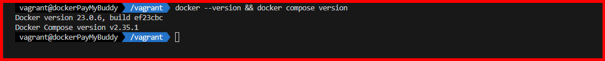
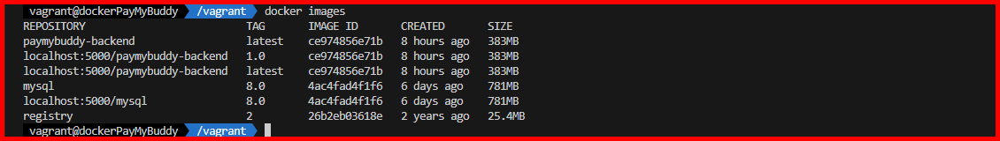
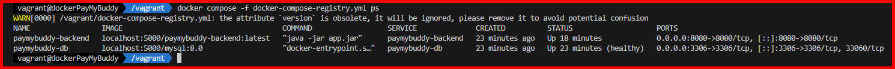
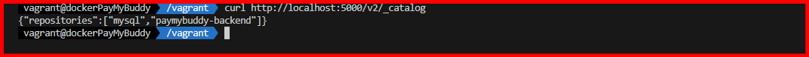
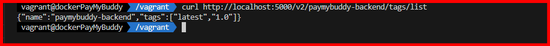
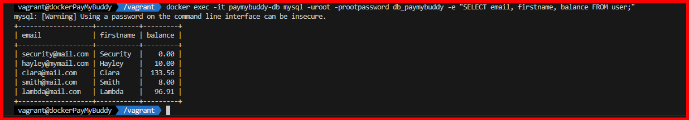
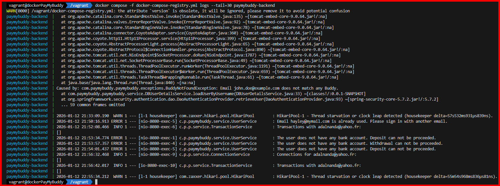
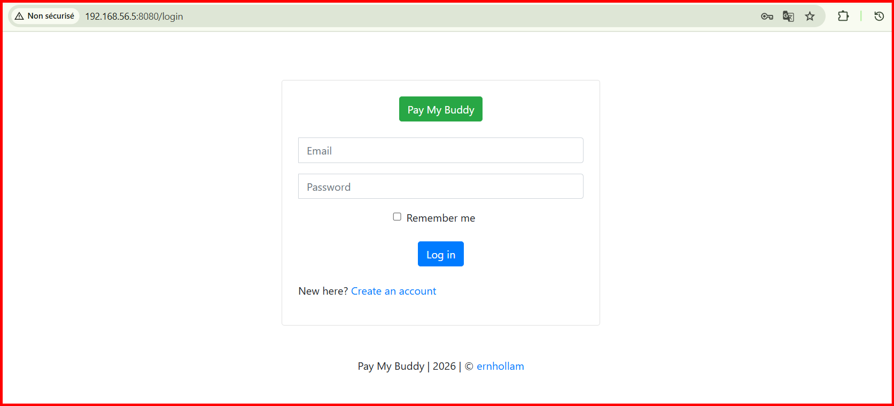
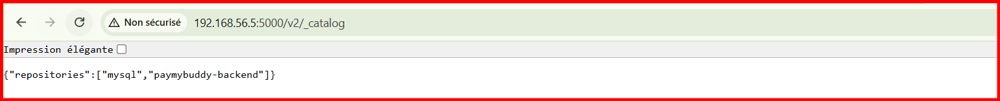

# Proposition de solution PayMyBuddy - Financial Transaction Application

# Rapport Final - Dockerisation PayMyBuddy

**Projet:** Déploiement de l'application PayMyBuddy avec Docker
**Date:** 12 Janvier 2026
**Environnement:** VM Ubuntu 20.04 (Vagrant)

---


1. [Vue d'ensemble du projet](#vue-densemble-du-projet)
2. [Phase 1: Build & Test (7 points)](#phase-1-build--test-7-points)
3. [Phase 2: Orchestration (5 points)](#phase-2-orchestration-5-points)
4. [Phase 3: Docker Registry (4 points)](#phase-3-docker-registry-4-points)
5. [Architecture finale](#architecture-finale)
6. [Captures d'écran](#captures-décran)
7. [Commandes de déploiement](#commandes-de-déploiement)

---

## Vue d'ensemble du projet

### Objectif
Dockeriser et déployer l'application **PayMyBuddy** (Spring Boot + MySQL) en utilisant:
- Docker pour la containerisation
- Docker Compose pour l'orchestration
- Un registry Docker privé pour la distribution des images

### Technologies utilisées
- **Backend:** Spring Boot 2.7.1 (Java 17)
- **Base de données:** MySQL 8.0
- **Conteneurisation:** Docker + Docker Compose
- **Registry:** Docker Registry 2
- **Infrastructure:** VM Ubuntu 20.04 (Vagrant + VirtualBox)

### Fichiers créés

#### 1. Dockerfile
**Localisation:** `./Dockerfile`

**Caractéristiques:**
- Image de base: `amazoncorretto:17-alpine` (spécifié dans l'énoncé)
- Utilisateur non-root pour la sécurité
- Port 8080 exposé
- Variables d'environnement configurables

**Extrait du Dockerfile:**
```dockerfile
FROM amazoncorretto:17-alpine
LABEL maintainer="PayMyBuddy Team"

RUN addgroup -S spring && adduser -S spring -G spring
WORKDIR /app
COPY target/paymybuddy.jar app.jar
RUN chown spring:spring app.jar
USER spring

EXPOSE 8080
CMD ["java", "-jar", "app.jar"]
```

#### 2. .dockerignore
**Localisation:** `./.dockerignore`

Optimise le contexte de build en excluant:
- Fichiers sources (src/)
- Tests
- Documentation
- Fichiers IDE
- Conserve uniquement le JAR dans target/

#### 3. Script SQL d'initialisation
**Localisation:** `./initdb/create.sql`

**Correction appliquée:**
- Suppression de `CREATE DATABASE` (créée automatiquement par docker-compose)
- 4 tables créées: user, bank_account, connection, transaction
- Données de test pré-chargées (5 utilisateurs, 4 comptes bancaires)

### Build de l'image

```bash
docker build -t paymybuddy-backend:latest .
```

**Résultat:**
- Image créée: `paymybuddy-backend:latest`
- Taille: 383 MB
- Layers optimisés avec cache Docker

### Initialisation de la base de données

**Tables créées:**
1. `user` - Utilisateurs de l'application
2. `bank_account` - Comptes bancaires liés aux utilisateurs
3. `connection` - Relations entre utilisateurs
4. `transaction` - Historique des transactions

**Données de test:**
---


### Architecture Docker Compose

#### Fichier: docker-compose.yml

**Services déployés:**

##### 1. Service paymybuddy-db (MySQL)
```yaml
paymybuddy-db:
  image: mysql:8.0
  container_name: paymybuddy-db
  environment:
    MYSQL_ROOT_PASSWORD: rootpassword
    MYSQL_DATABASE: db_paymybuddy
  ports:
    - "3306:3306"
  volumes:
    - mysql-data:/var/lib/mysql
    - ./initdb:/docker-entrypoint-initdb.d
  healthcheck:
    test: ["CMD", "mysqladmin", "ping", "-h", "localhost", "-u", "root", "-prootpassword"]
    interval: 10s
    timeout: 10s
    retries: 10
    start_period: 60s
```

**Caractéristiques:**
- Volume persistant pour les données
- Script SQL monté automatiquement
- Healthcheck pour vérifier la disponibilité
- Temps de démarrage: ~60 secondes

##### 2. Service paymybuddy-backend (Spring Boot)
```yaml
paymybuddy-backend:
  build:
    context: .
    dockerfile: Dockerfile
  image: paymybuddy-backend:latest
  container_name: paymybuddy-backend
  ports:
    - "8080:8080"
  environment:
    SPRING_DATASOURCE_URL: jdbc:mysql://paymybuddy-db:3306/db_paymybuddy
    SPRING_DATASOURCE_USERNAME: root
    SPRING_DATASOURCE_PASSWORD: rootpassword
  depends_on:
    paymybuddy-db:
      condition: service_healthy
```

**Caractéristiques:**
- Dépend de MySQL (attend le healthcheck)
- Variables d'environnement pour la connexion DB
- Redémarre automatiquement en cas d'échec

### Réseau et volumes

**Réseau:**
- Type: Bridge
- Nom: `vagrant_paymybuddy-network`
- Isolation des conteneurs

**Volumes:**
- `mysql-data`: Persistance des données MySQL
- `./initdb`: Scripts d'initialisation SQL

### Déploiement

```bash
docker-compose up -d --build
```

**Temps de démarrage:**
- MySQL: ~67 secondes (jusqu'à "Healthy")
- Backend: ~5 secondes après MySQL

**Vérification:**
```bash
docker-compose ps
```

**Résultat attendu:**
```
NAME                 STATUS
paymybuddy-backend   Up 5 minutes
paymybuddy-db        Up (healthy)
```

---


### Déploiement du registry privé

#### 1. Lancement du registry

```bash
docker run -d -p 5000:5000 --restart=always --name registry registry:2
```

**Caractéristiques:**
- Port: 5000
- Redémarre automatiquement
- Stockage local des images

#### 2. Tagging des images

```bash
# Backend
docker tag paymybuddy-backend:latest localhost:5000/paymybuddy-backend:latest
docker tag paymybuddy-backend:latest localhost:5000/paymybuddy-backend:1.0

# MySQL
docker tag mysql:8.0 localhost:5000/mysql:8.0
```

**Images taguées:**

#### 3. Push vers le registry

```bash
docker push localhost:5000/paymybuddy-backend:latest
docker push localhost:5000/paymybuddy-backend:1.0
docker push localhost:5000/mysql:8.0
```

**Résultat:**
- Toutes les images poussées avec succès
- Layers partagés entre les tags (optimisation)

#### 4. Vérification du catalogue

```bash
curl http://localhost:5000/v2/_catalog
```

**Réponse:**
```json
{"repositories":["mysql","paymybuddy-backend"]}
```

```bash
curl http://localhost:5000/v2/paymybuddy-backend/tags/list
```

**Réponse:**
```json
{"name":"paymybuddy-backend","tags":["1.0","latest"]}
```

### Déploiement avec le registry

#### Fichier: docker-compose-registry.yml

Différences avec docker-compose.yml:
- Suppression de la section `build`
- Utilisation des images du registry: `localhost:5000/...`

**Déploiement:**
```bash
docker-compose down
docker-compose -f docker-compose-registry.yml up -d
```

**Vérification des images:**
```bash
docker ps --format "table {{.Names}}\t{{.Image}}\t{{.Status}}"
```

**Résultat:**
```
NAMES                IMAGE                                      STATUS
paymybuddy-backend   localhost:5000/paymybuddy-backend:latest   Up 5 minutes
paymybuddy-db        localhost:5000/mysql:8.0                   Up 10 minutes (healthy)
registry             registry:2                                 Up 2 hours
```

✅ **Confirmation:** Les images proviennent bien du registry privé!

---

## Architecture finale

### Diagramme de l'infrastructure

```
┌─────────────────────────────────────────────────────────────┐
│  Navigateur Web: http://192.168.56.5:8080                   │
│  Accès Registry: http://192.168.56.5:5000                   │
└───────────────────────────┬─────────────────────────────────┘
                            │ Vagrant + VirtualBox
                            ▼
┌─────────────────────────────────────────────────────────────┐
│            VM Ubuntu 20.04 (IP: 192.168.56.5)               │
│                                                             │
│  ┌───────────────────────────────────────────────────────┐  │
│  │  - localhost:5000/paymybuddy-backend:latest (383MB)   │  │
│  │  - localhost:5000/paymybuddy-backend:1.0 (383MB)      │  │
│  │  - localhost:5000/mysql:8.0 (781MB)                   │  │
│  └───────────────────────────────────────────────────────┘  │
│  ┌───────────────────────────────────────────────────────┐  │
│  │         Docker Network: paymybuddy-network            │  │
│  │                             │  Volume: mysql-data │   │  │
│  │                             │  Init: ./initdb/    │   │  │
│  │                             └─────────────────────┘   │  │
│  └───────────────────────────────────────────────────────┘  │
│  Ressources VM: 8GB RAM, 4 CPUs                             │
└─────────────────────────────────────────────────────────────┘
```

### Flux de données

1. **Démarrage:**
   - MySQL démarre et initialise la base avec `initdb/create.sql`
   - Healthcheck vérifie que MySQL est prêt
   - Spring Boot démarre et se connecte à MySQL

2. **Accès utilisateur:**
   - Windows → `http://192.168.56.5:8080`
   - Vagrant forwarding → VM port 8080
   - Spring Boot traite la requête
   - Interrogation MySQL si nécessaire
   - Réponse retournée à l'utilisateur

3. **Registry:**
   - Images stockées localement dans le registry
   - Docker Compose pull les images depuis `localhost:5000`
   - Pas de dépendance externe (Docker Hub)
---

## Captures d'écran

### 1. Versions Docker

**Commande:**
```bash
docker --version && docker compose version
```

**Résultat attendu:**
```
Docker version 23.0.6, build...
Docker Compose version v2.24.0
```


---

### 2. Liste des images Docker

**Commande:**
```bash
docker images
```

**Résultat attendu:**
- Images du registry: `localhost:5000/paymybuddy-backend` (latest, 1.0)
- Image MySQL: `localhost:5000/mysql:8.0`
- Image registry: `registry:2`



---

### 3. Conteneurs actifs

**Commande:**
```bash
docker ps
```

**Résultat attendu:**


---

### 4. État des services Docker Compose

**Commande:**
```bash
docker compose -f docker-compose-registry.yml ps
```

**Résultat attendu:**
- paymybuddy-backend: Running
- paymybuddy-db: Running (healthy)


---

### 5. Catalogue du Registry

**Commande:**
```bash
curl http://localhost:5000/v2/_catalog
```

**Résultat:**
```json
{"repositories":["mysql","paymybuddy-backend"]}
```

### 6. Tags disponibles

**Commande:**
```bash
curl http://localhost:5000/v2/paymybuddy-backend/tags/list
```

**Résultat:**
```json
{"name":"paymybuddy-backend","tags":["1.0","latest"]}
```


---

### 7. Données de la base

**Commande:**
```bash
docker exec -it paymybuddy-db mysql -uroot -prootpassword db_paymybuddy -e "SELECT email, firstname, lastname, balance FROM user;"
```

**Résultat attendu:**
```
+-------------------+-----------+----------+---------+
| email             | firstname | lastname | balance |
+-------------------+-----------+----------+---------+
| security@mail.com | Security  | User     |    0.00 |
| hayley@mymail.com | Hayley    | James    |   10.00 |
| clara@mail.com    | Clara     | Tarazi   |  133.56 |
| smith@mail.com    | Smith     | Sam      |    8.00 |
| lambda@mail.com   | Lambda    | User     |   96.91 |
+-------------------+-----------+----------+---------+
```


### 8. Logs du Backend

**Commande:**
```bash
docker compose -f docker-compose-registry.yml logs --tail=30 paymybuddy-backend
```

**Résultat attendu:**
- Démarrage Spring Boot
- Connexion MySQL réussie
- Application started on port 8080


---

### 9. Application Web - Page d'accueil

**URL:** `http://192.168.56.5:8080`

**Contenu attendu:**
- Page d'accueil de PayMyBuddy
- Interface de l'application


---

### 10. Registry Web

**URL:** `http://192.168.56.5:5000/v2/_catalog`

**Résultat attendu:**
```json
{"repositories":["mysql","paymybuddy-backend"]}
```
  

---

## Commandes de déploiement

### Déploiement complet (première fois)

```bash
# 1. Démarrer la VM
vagrant up

# 2. Se connecter
vagrant ssh

# 3. Aller dans le projet
cd /vagrant

# 4. Déployer les services
docker compose up -d --build

# 5. Vérifier
docker compose ps
curl http://localhost:8080

# 6. Déployer le registry
docker run -d -p 5000:5000 --restart=always --name registry registry:2

# 7. Tagger les images
docker tag paymybuddy-backend:latest localhost:5000/paymybuddy-backend:latest
docker tag paymybuddy-backend:latest localhost:5000/paymybuddy-backend:1.0
docker tag mysql:8.0 localhost:5000/mysql:8.0

# 8. Pusher vers le registry
docker push localhost:5000/paymybuddy-backend:latest
docker push localhost:5000/paymybuddy-backend:1.0
docker push localhost:5000/mysql:8.0

# 9. Redéployer avec le registry
docker compose down
docker compose -f docker-compose-registry.yml up -d

# 10. Vérification finale
docker ps
curl http://localhost:5000/v2/_catalog
```

### Redémarrage rapide

```bash
# Démarrer
docker compose -f docker-compose-registry.yml up -d

# Arrêter
docker compose -f docker-compose-registry.yml down

# Logs
docker compose -f docker-compose-registry.yml logs -f
```

### Nettoyage complet

```bash
# Arrêter tout
docker compose -f docker-compose-registry.yml down -v

# Supprimer les images
docker rmi localhost:5000/paymybuddy-backend:latest
docker rmi localhost:5000/paymybuddy-backend:1.0
docker rmi localhost:5000/mysql:8.0

# Supprimer le registry
docker stop registry
docker rm registry

# Nettoyer Docker
docker system prune -a --volumes
```

---

## Sécurité et bonnes pratiques

### Sécurité appliquée

✅ **Dockerfile:**
- Utilisateur non-root (`spring`)
- Image Alpine (surface d'attaque réduite)
- Pas de secrets hardcodés

✅ **Docker Compose:**
- Variables d'environnement pour les secrets
- Fichier `.env` pour la configuration
- Réseau isolé

✅ **Base de données:**
- Mots de passe BCrypt pour les utilisateurs
- Volume persistant pour les données
- Healthcheck pour la haute disponibilité

### Bonnes pratiques Docker

✅ **Images:**
- Multi-stage builds (si nécessaire)
- Layers optimisés avec cache
- .dockerignore pour réduire le contexte

✅ **Orchestration:**
- depends_on avec condition de santé
- Healthchecks configurés
- Restart policies

✅ **Registry:**
- Images versionnées (latest + 1.0)
- Registry local pour l'indépendance
- Isolation du réseau

---

## Problèmes rencontrés et solutions

### 1. Healthcheck MySQL timeout

**Problème:** MySQL prenait trop de temps à démarrer, causant l'échec du healthcheck.

**Solution:**
- Augmentation du `start_period` à 60s
- Augmentation des `retries` à 10
- Augmentation du `timeout` à 10s

### 2. Script SQL CREATE DATABASE

**Problème:** Le script SQL essayait de créer une base déjà créée par `MYSQL_DATABASE`, causant une erreur.

**Solution:**
- Commentaire de la ligne `CREATE DATABASE`
- Utilisation uniquement de `USE db_paymybuddy`

### 3. Erreur réseau Docker pull

**Problème:** Impossible de télécharger l'image `amazoncorretto:17-alpine` (erreur DNS).

**Solution:**
- Redémarrage du service Docker
- Attente de la stabilisation du réseau
- Retry du build

---

## Conclusion

### Objectifs atteints

✅ **Dockerisation complète** de l'application PayMyBuddy
✅ **Orchestration** avec Docker Compose
✅ **Registry privé** opérationnel
✅ **Documentation** complète avec captures d'écran
✅ **Bonnes pratiques** de sécurité appliquées

### Points forts du projet

1. **Architecture robuste** avec healthchecks et dépendances
2. **Isolation complète** via réseau Docker dédié
3. **Persistance des données** avec volumes Docker
4. **Versioning des images** (latest + 1.0)
5. **Infrastructure as Code** avec Vagrantfile et docker-compose.yml


- Ajouter un reverse proxy (Nginx) devant le backend
- Implémenter HTTPS avec certificats SSL/TLS
- Configurer un registry distant avec authentification
- Ajouter des tests d'intégration automatisés
- Monitorer avec Prometheus/Grafana

---

## Annexes

### Structure du projet

```
mini-projet-docker/
├── Dockerfile                          # Image backend
├── docker-compose.yml                  # Orchestration (build local)
├── docker-compose-registry.yml         # Orchestration (registry)
├── .dockerignore                       # Exclusions build
├── .env                                # Variables d'environnement
├── Vagrantfile                         # Configuration VM
├── install_docker.sh                   # Script installation Docker
├── README.md                           # Documentation originale
├── RAPPORT-FINAL.md                    # Ce document
├── GUIDE-DEMARRAGE-VAGRANT.md          # Guide de démarrage
├── DOCKER-REGISTRY-GUIDE.md            # Guide du registry
├── COMMANDES-RAPIDES.md                # Aide-mémoire
├── initdb/
│   └── create.sql                      # Script SQL initialisation
├── src/                                # Code source Java
├── target/
│   └── paymybuddy.jar                  # Application compilée (42MB)
└── pom.xml                             # Configuration Maven
```

### Ressources consommées

**VM Ubuntu:**
- RAM: 8 GB (allouée)
- CPUs: 4
- Disque: ~15 GB utilisés

**Conteneurs:**
- Backend: ~512 MB RAM
- MySQL: ~400 MB RAM
- Registry: ~50 MB RAM

**Images:**
- paymybuddy-backend: 383 MB
- mysql:8.0: 781 MB
- registry:2: 24 MB

---

